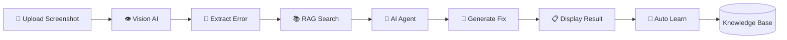

<div align="center">

# 📸 Screenshot Error Diagnoser

### 🤖 AI-Powered Error Detection & Resolution


<br>


<br>


<br><br>

### 🚀 Upload → Analyze → Fix

*Transform error screenshots into actionable solutions using Vision AI, RAG, and AI Agents.*

</div>

---

## 🎯 Problem Statement

Developers often waste time manually typing error messages and searching through forums.

**Screenshot Error Diagnoser** solves this by:

📸 Reading error screenshots automatically

🧠 Matching against a knowledge base

🤖 Generating AI-powered solutions

🔄 Learning from new errors

---

## ⚡ Workflow



---

## ✨ Features

| Feature              | Description                 |
| -------------------- | --------------------------- |
| 📸 Screenshot Upload | Upload any error screenshot |
| 👁️ Vision LLM       | Extract text from image     |
| 🧠 RAG Search        | Search known issues         |
| 🤖 AI Diagnosis      | Generate solutions          |
| 📚 History           | Store previous diagnoses    |
| 🔄 Auto Learning     | Learn new errors            |
| 💰 Token Tracking    | Monitor API costs           |
| 📋 Copy Solution     | One-click copy              |
| 🎨 Modern UI         | Glassmorphism interface     |

---

## 🏗️ Architecture

```text
Screenshot
     │
     ▼
Vision AI
     │
     ▼
Error Extraction
     │
     ▼
RAG Search
     │
     ▼
AI Diagnosis
     │
     ▼
Fix Generation
     │
     ▼
Auto Learning
```

---

## 🛠️ Tech Stack

### Backend

* Python 3.11+
* Flask 3.0

### AI

* OpenRouter API
* Gemini Models
* Llama Models

### Storage

* JSON Knowledge Base

### Frontend

* HTML5
* CSS3
* JavaScript

---

## 🚀 Quick Start

```bash
git clone https://github.com/YOUR_USERNAME/Screenshot-Error-Diagnoser.git

cd Screenshot-Error-Diagnoser

python -m venv venv

source venv/bin/activate

pip install -r requirements.txt

python app.py
```

---

## 🎮 Example

### Input

```text
ModuleNotFoundError:
No module named 'flask'
```

### Output

```text
1. Install Flask

pip install flask

2. Verify Installation

pip list

3. Activate Virtual Environment

4. Restart Application
```

---

## 📊 AI Capabilities

| Capability        | Status |
| ----------------- | ------ |
| Vision LLM        | ✅      |
| RAG Engine        | ✅      |
| AI Agent Workflow | ✅      |
| Knowledge Base    | ✅      |
| Auto Learning     | ✅      |
| API Integration   | ✅      |

---

## 🧪 Testing

```bash
pytest tests/ -v
```

Expected Output:

```text
✅ test_rag_finds_module_error

✅ test_rag_finds_econnrefused

✅ test_rag_returns_empty

✅ test_knowledge_base

✅ test_index_returns_200
```

---

## 🚀 Future Enhancements

* OCR Fallback Engine
* Local LLM Support
* Mobile Application
* Vector Database
* Voice Explanations
* Cloud Deployment

---

## 🤝 Contributing

Contributions are welcome.

```bash
Fork → Clone → Code → Commit → Push → Pull Request
```

---

## ⭐ Support

If you found this project useful:

⭐ Star the repository

🍴 Fork it

🛠️ Contribute improvements

---

<div align="center">

### 💙 Built with Python, Flask, OpenRouter, Vision AI and RAG


</div>
